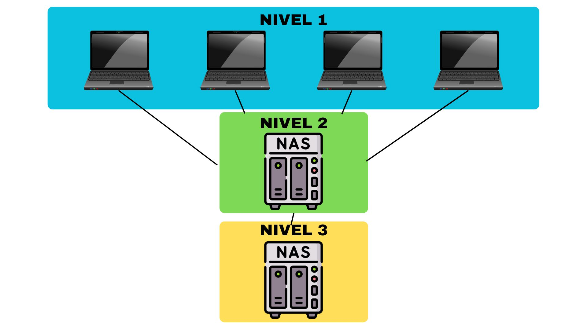
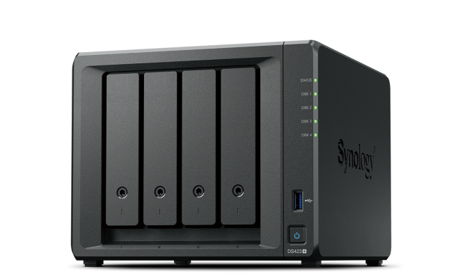

# Sistema de Copias de Seguridad Automatizadas Multicapa

## 1.  **Arquitectura General del Sistema (ALEJANDRO ALEDO)**

🔹   Actividad: Haz un esquema explicando los tres niveles del sistema de backups.

<div align="center";">
  
</div>

### Guía de investigación: ¿Qué rol cumple cada nivel?

- **Nivel 1:** Equipos de la empresa, son los que tienen los datos que se transfieren periódicamente al servidor al que están conectados.
- **Nivel 2:** Es el primer servidor local, es el encargado de realizar una copia de seguridad de los datos de los equipos de la empresa, esta deberá estar programada para que de manera automática realice las copias.
- **Nivel 3:** Es el segundo servidor, que suele ser remoto, este se encarga de hacer una copia completa de todos los datos que tenga el primer servidor local, de esta manera se asegura que no exista una pérdida de datos en caso de que el primer servidor falle.

### ¿Qué tipo de dispositivos hay en cada uno?

- **Nivel 1:** Los equipos de este nivel suelen ser equipos de sobremesa o portátiles conectados a la misma red que el servidor local.
- **Nivel 2:** Este primer servidor es un servidor NAS de la marca Synology.
- **Nivel 3:** Este segundo servidor es un servidor NAS también.

---

## 2.  **Configuración del Nivel 1: PCs Individuales (ALEJANDRO ALEDO)**

### a.  **Selección de software**

🔹   Actividad: Investiga y selecciona un software de backup para:

**Windows:** Macrium Reflect

**macOS:** Apple Time Machine

**Linux:** Rsync

### Guía de investigación: ¿Qué opciones gratuitas existen?

- **Macrium Reflect:** La versión gratuita de Macrium Reflect permite realizar copias de seguridad completas y diferenciales, así como la clonación de discos.
- **Apple Time Machine:** Es la herramienta de copia de seguridad integrada y gratuita en macOS. Realiza copias automáticas de archivos, aplicaciones y configuraciones del sistema, permitiendo restaurar el sistema completo o archivos individuales a un estado anterior.
- **Rsync:** Rsync es una herramienta de línea de comandos gratuita y de código abierto para la sincronización y copia de seguridad de archivos.

### ¿Qué ventajas tiene cada una?

- **Macrium Reflect:** Dispone de una interfaz muy intuitiva y fácil de usar, sus opciones son claras y permite la creación de imágenes de disco completas y clonación de discos.
- **Apple Time Machine:** Fácil de utilizar y no necesita intervención del usuario para hacer copias de seguridad, manteniendo la integridad de los datos siempre. Este software permite restaurar el sistema completo o archivos específicos en el tiempo.
- **Rsync:** Herramienta muy usada, ya que permite automatización de copias de seguridad, además de opciones de compresión y de cifrado para ofrecer una mayor seguridad. Este software se usa desde la terminal de comandos, y aunque no sea la opción más atractiva, es una de las más completas.

### b.  **Programación de copias**

🔹   Actividad: Describe cómo programar:

Copias incrementales diarias

| Día       | Tipo de copia   | Descripción                                                      |
| --------- | --------------- | ---------------------------------------------------------------- |
| Lunes     | 🟦 Copia completa | Se guarda todo el sistema. Punto de restauración inicial.           |
| Martes    | 🟨 Incremental    | Guarda solo los cambios desde el lunes.                           |
| Miércoles | 🟨 Incremental    | Cambios desde el martes.                                       |
| Jueves    | 🟨 Incremental    | Cambios desde el miércoles.                                    |
| Viernes   | 🟨 Incremental    | Cambios desde el jueves.                                       |
| Sábado    | 🟨 Incremental    | Cambios desde el viernes.                                      |
| Domingo   | 🟨 Incremental    | Cambios desde el sábado.                                       |

Copias completas semanales

| Día       | Tipo de copia   | Descripción                                                                  |
| --------- | --------------- | ---------------------------------------------------------------------------- |
| Lunes     | 🟦 Copia completa | Se guarda todo el sistema. Este es el punto de restauración de la semana.       |
| Martes    | 🟨 Incremental    | Se realiza una copia incremental de lo realizado después de la copia completa. |
| Miércoles | 🟨 Incremental    | Se copian los cambios que se hicieron el martes.                              |
| Jueves    | 🟩 Diferencial    | Se copian los cambios desde la última copia completa.                       |
| Viernes   | 🟨 Incremental    | Se respaldan los cambios desde la última incremental                           |
| Sábado    | 🟩 Diferencial    | Se vuelven a copiar todos los cambios desde el lunes.                        |
| Domingo   | 🟦 Copia completa | Se vuelve a hacer una copia completa para finalizar con la semana.            |

### Guía: ¿Cómo se configura eso en el software que elegiste?

- **Macrium Reflect:**
  
  - Abrir Macrium Reflect:
    Inicia Macrium Reflect.
    Ve a la pestaña "Backup" (arriba a la izquierda).
    Haz clic en "Backup Definition Files".
  - Programar copias:
    Selecciona el archivo XML de definición de respaldo que deseas programar.
    Haz clic en "Schedule" o haz clic derecho en el archivo y selecciona "Schedule".
  - Crear dos tareas programadas:
    Copias completas semanales:
    Tipo de backup: Selecciona "Full".
    Frecuencia: Elige "Weekly".
    Día: Selecciona el día deseado para la copia de seguridad completa (por ejemplo, domingo).
    Copias incrementales diarias:
    Tipo de backup: Selecciona "Incremental".
    Frecuencia: Elige "Daily" y selecciona los días individuales.
    Días: Selecciona los días de la semana en los que deseas realizar copias de seguridad incrementales (por ejemplo, de lunes a sábado).
- **Apple Time Machine:**

  - Conecta un disco duro externo a tu Mac. Se recomienda que el disco externo sea más grande que el disco de origen.
  -Abre Time Machine y haz clic en el menú Apple > Configuración del Sistema > General en la barra lateral > Time Machine.
  - Si es la primera vez que usas Time Machine, te preguntará si quieres usar este disco duro como disco de destino. Haz clic en el botón "Usar como disco de copia de seguridad". Si no, haz clic en el botón "Seleccionar     disco de copia de seguridad" para añadir el disco de destino. Puedes marcar la opción "Cifrar disco de copia de seguridad" para proteger tus datos.
  - Una vez que selecciones el disco de copia de seguridad, Time Machine comenzará a crear una copia de seguridad automáticamente.
  - Cambiar la frecuencia de copia de seguridad de Time Machine:
    Abre la configuración de Time Machine y haz clic en "Opciones".
  - Haz clic en la opción "Frecuencia de copia de seguridad" y elige una frecuencia. Solo ofrece cuatro opciones:
    - Manualmente
    - Cada hora
    - Cada día
    - Cada semana
  - Por último, selecciona la frecuencia que necesites en base a tu programación.
- **Rsync:**
  
  **Copia incremental diaria:**
  
  Crea la estructura de carpetas en las que vayas a hacer las copias:
  
  ```bash
  mkdir -p /mnt/backup_drive/daily
  mkdir -p /mnt/backup_drive/current
  ```
  
  Script de copia incremental:
  
  Este script se ejecuta de lunes a sábado usando cron:
  
  ```bash
  SOURCE="/home/username/"
  DEST="/mnt/backup_drive"
  TODAY=$(date +%Y-%m-%d)
  
  rsync -av --delete --link-dest="$DEST/current" "$SOURCE" "$DEST/daily/$TODAY"
  rm -rf "$DEST/current"
  cp -al "$DEST/daily/$TODAY" "$DEST/current"
  ```
  
  Abre el cron:
  
  ```bash
  crontab -e
  ```
  
  Y añade esta línea, que se ejecuta a medianoche de lunes a sábado:
  
  ```bash
  0 0 * * 1-6 /home/username/backup.sh
  ```
  
  **Copias completas semanales:**
  
  Crear carpeta para las copias completas
  
  ```bash
  mkdir -p /mnt/backup_drive/full
  ```
  
  Script de copia completa (ya incluido en el mismo backup.sh):
  
  El mismo script detecta si es domingo (día 0) y hace una copia completa:
  
  ```bash
  SOURCE="/home/username/"
  DEST="/mnt/backup_drive"
  TODAY=$(date +%Y-%m-%d)
  rsync -av --delete --link-dest="$DEST/current" "$SOURCE" "$DEST/daily/$TODAY"
  rm -rf "$DEST/current"
  cp -al "$DEST/daily/$TODAY" "$DEST/current"
  ```
  
  Abre el cron:
  
  ```bash
  crontab -e
  ```
  
  Y añade esta línea:
  
  ```bash
  0 0 * * 1-6 /home/username/backup_daily.sh
  ```

### c.  **Destino del backup**

🔹   Actividad: Indica cómo se configura para que el backup vaya al servidor local (Nivel 2) y cómo se organizan las carpetas para cada PC.

Al elegir un NAS como servidor local donde alojar nuestros archivos, instalaremos el programa Synology Drive, este programa tiene muchas funcionalidades, entre ellas destaca la sincronización de copias de seguridad automáticas. Este software detecta cuando los archivos llevan un tiempo sin asegurar, cuando vea este comportamiento, se realizará una petición para que comience la copia de seguridad. El software que usarán los clientes de este NAS sería “Synology Drive Client”.

---

## 3.  **Configuración del Nivel 2: Servidor Local Primario (ALEJANDRO ALEDO)**

### a.  **Hardware**

🔹   Actividad: Elige una de estas opciones e investiga precios y características:

NAS (marca/modelo)

En este caso, tenemos este [NAS](https://www.pccomponentes.com/synology-diskstation-ds423-servidor-de-almacenamiento-nas), que forma parte de la marca Synology y tiene como modelo el “DS423”, sus principales características son:

- **Rendimiento:** Procesador Intel Celeron J4125 (4 núcleos a 2 GHz, hasta 2,7 GHz) y 2 GB de RAM (expandible hasta 6 GB).

- **Protección de datos:** Sistema de archivos Btrfs que protege contra corrupción y permite restauraciones con instantáneas.

- **Almacenamiento:** Soporta RAID 0, 1, 5, 6, 10 y JBOD con capacidad para 4 unidades HDD o SSD y 2 ranuras M.2 NVMe para caché.

- **Conectividad:** 2 puertos Ethernet LAN y 2 puertos USB 3.2 Gen 1.

- **Eficiencia:** Diseño compacto con ventilación activa y bajo consumo energético para uso continuo.

<div align="center";">
  
</div>

### b.  **RAID**

🔹   Actividad: Explica qué tipo de RAID elegirías y por qué: RAID 1, RAID 5 o RAID 10.

Entre las opciones dadas, pienso que la opción más viable sería un RAID 10, esto es debido a que ofrece características mucho más beneficiosas para una empresa que un RAID 5. Ofrece protección contra fallos de discos, hasta 2 discos, además de ofrecer un mejor rendimiento en lectura y escritura. Aunque su almacenamiento se rebaje al 50%, lo compensa el hecho de la protección que ofrece contra fallos.

### **Guía:** ¿Qué ventaja ofrece frente a un solo disco?

La principal ventaja que ofrece es la protección de los datos, algo esencial dentro de una empresa, ya que un solo disco depende de sí mismo, en caso de que un día comience a fallar, todos los datos dentro de él se perderán y no se podrían recuperar. Un RAID es la solución a ese problema, ya que al combinar varios discos de forma sincronizada, incluso cuando un disco falle, los datos seguirán pudiendo ser accesibles.

### c.  **Software de gestión centralizada**

🔹   Actividad: Investiga y elige una herramienta como:

**Hyper Backup:** Es un programa diseñado por Synology, ideal para los NAS elegidos, este se encarga de realizar copias de seguridad, ya sea de carpetas de archivos, configuraciones del sistema, o clonados por completo de un sistema operativo, que pueden ser programables. Este software se encarga de hacer un registro histórico de los archivos para poder llevar un seguimiento, además de comprobaciones de integridad de datos y uso de sistema de cifrados seguros (AES-256).

##   4.  **Configuración del Nivel 3: Servidor Secundario Remoto (ALEJANDRO GARCÍA)**

###   a.  **Opción de servidor remoto**

🔹   Actividad: Elige una de estas opciones y justifica:

-   NAS en otra ubicación

He elegido NAS por su independencia geográfica, lo que lo protege contra desastres físicos, por su relación coste-beneficio, ya que es más económico, y por su facilidad de mantenimiento en comparación con los servicios en la nube, especialmente cuando se manejan grandes volúmenes de datos.
 Además, ofrece un control total, lo que permite mantener tanto el control físico como lógico de los datos.
 También cuenta con una gran compatibilidad, ya que incluye soporte para realizar copias de seguridad remotas, sincronización cifrada y aplicaciones de seguridad avanzadas.


###   b.  **Sincronización segura**

🔹   Actividad: Explica cómo programar copias diarias o semanales y qué opciones existen para:

Para programar una copia, ya sea diaria o semanal, necesitas usar una aplicación de respaldo que te permita automatizar dependiendo del sistema operativo y de los datos que quieras guardar, por ejemplo, en linux puedes usar rsync y cron para hacer las copias de seguridad con el comando: “0 3 \* \* \* rsync -avz /home/alex/Escritorio /home/alex/Escritorio/copiaDeSeguridad”.


-   **Cifrado de datos en tránsito**

Para hacer un cifrado de datos en tránsito se dispone de varias alternativas, como por ejemplo:

-   Puedes utilizar rsync sobre SSH.
   
-   Podrías usar una VPN.
   
-   Utilizando el protocolo HTTPS que utilizan aplicaciones vía web.
   
-   Usando un cifrado de extremo a extremo con herramientas como “Duplicati”.
   
-   Autenticación de dos factores

Para utilizar la autenticación de dos factores, puedes usar:

-   SSH con 2FA
-   Configurando google PAM para conseguir un código de autenticación adicional
-   Utilizando aplicaciones de respaldo como “Synology Active Backup” y “Duplicati”.
   

---

##   5.  **Automatización del Proceso (ALEJANDRO GARCÍA)**

🔹   Actividad:

-   Busca un ejemplo de script de comprobación de backup

    ```bash
    BACKUP_DIR="/var/backups"
    BACKUP_FILE="backup-*.tar.gz"
    if find "$BACKUP_DIR" -name "$BACKUP_FILE" -mtime -1 | grep .; then
    echo "backup verificado correctamente."
    else
    echo " no se ha encontrado un backup reciente." | mail -s "alerta: backup no reciente" admin@gmail.com
    fi
    ```

    Este script verifica si se ha creado el backup hace 24 horas y envía una alerta al gmail si no la encuentra

-   ¿Cómo se configura una alerta por email?

    En ubuntu, instalas mailutils con el comando:

    ```bash
    sudo apt install mailutils.
    ```

    Una vez instalado el comando mail se usa para enviar correos por ejemplo:

    ```bash
    echo “cuerpo del mensaje” | mail -s “asunto del correo” destino@gmail.com
    ```

-   ¿Qué pruebas de restauración periódicas recomiendas hacer?

    Restauración parcial, restauraciones completas, hacer verificaciones de integridad y tener hecha la restauración automáticamente

---

##   6.  **Justificación del uso de RAID (JUAN)**

🔹   Actividad:

Explica por qué el RAID no reemplaza a las copias de seguridad.
 ¿Qué pasaría si sólo tienes RAID pero no backups?

La abreviatura RAID significa Redundant Array of Independent Disks, es decir, una disposición redundante de discos duros independientes.
 En lenguaje llano, significa que en lugar de un único disco duro, funcionan varios discos similares en red.
 Dependiendo del diseño del sistema, esto puede aumentar la seguridad de los datos, ya que archivos idénticos pueden estar distribuidos en distintos discos duros.
 Además del aspecto de una mejor protección contra la pérdida de datos, esto también ofrece ventajas de velocidad a la hora de acceder a los datos, por lo que el RAID es de interés sobre todo para redes rápidas.
 Sin embargo, independientemente del número de discos duros y del modo RAID utilizado, pueden producirse pérdidas de datos.
 Si los datos se escriben incorrectamente, un virus hace estragos o se produce un error de software, estos problemas también se trasladan a los datos copiados y pueden quedar inutilizables a pesar de múltiples ejecuciones.
 Además, los archivos borrados accidentalmente no pueden restaurarse sin más.
 Por lo tanto, a pesar del RAID, las copias de seguridad periódicas no deben descuidarse bajo ningún concepto.
 Sólo las copias de seguridad periódicas pueden garantizar la recuperación en caso de emergencia.
 RAID asegura (especialmente en las etapas de mayor expansión) que el trabajo en la red pueda continuar sin interrupciones si uno (o más) discos fallan.
 Éstos pueden sustituirse durante el funcionamiento sin tener que dejar de trabajar con los datos.
 Sin embargo, no se recomienda prescindir de una copia de seguridad debido a RAID.
 Si solo tuvieras RAID y no copias de datos si te entra un virus o se te rompe más de 1 disco duro del RAID perderás toda tu información por eso no es recomendable.

 ---

##   7.  **Resumen de Software Recomendado (JUAN)**

🔹   Actividad:

Haz una tabla que incluya:

| Función                        | Software sugerido          |
| ------------------------------ | -------------------------- |
| Gestión centralizada           | Sistema Gestión de Dispositivos PerleVIEW |
| Sincronización entre servidores | FreeFileSync               |
| Monitorización                 | Workmeter                  |

Completa con lo investigado.

---

##   **BIBLIOGRAFÍA:**

-   Alejandro García:
    -   <https://www.xataka.com/n/accede-a-tus-datos-cualquier-lugar-ventajas-almacenar-compartir-nas>
    -   <https://unamiradaentrebytes.wordpress.com/2024/06/10/configuracion-de-backups-automaticos-con-rsync/>
    -   <https://phoenixnap.com/kb/how-to-rsync-over-ssh>
    -   <https://medium.com/@prateek.malhotra004/enhancing-ssh-security-with-two-factor-authentication-2fa-via-pam-and-google-authenticator-70af135c2a95>
    -   <https://help.ubuntu.com/community/BackupYourSystem>
-   Juan:
    -   <https://www.langmeier-software.com/es/seiten/news/was-ist-der-unterschied-zwischen-raid-und-backup>
    -   <https://www.perlesystems.es/products/perleview.shtml>
    -   <https://www.softzone.es/programas/sistema/programas-sincronizar-carpetas/>
    -   <https://www.workmeter.com/control-productividad-empleados/?gclid=Cj0KCQjw5ubABhDIARIsAHMighY6SbXdz1wLy3IwQ6e4H4UutMVg2hwBzGN4_DtVpCpdXcBJxjnIh80aAlgwEALw_wcB&utm_term=software%20de%20monitoreo%20de%20empleados&utm_campaign=ES-ES-TIE-GEN-BROAD&utm_source=google&utm_medium=cpc&gad_source=1&gad_campaignid=21816667196&gbraid=0AAAAADy4gjYFdgXfc8U1k98EIH3dAJyjU>
-   Alejandro Aledo:
    -   <https://www.tecmint.com/linux-system-backup-tools/>
    -   <https://www.macworld.com/article/668696/best-mac-backup-software.html>
    -   <https://www.synology.com/es-mx/dsm/feature/drive>
    -   <https://www.synology.com/es-mx/dsm/feature/hyper_backup>
    -   <https://www.pccomponentes.com/synology-diskstation-ds423-servidor-de-almacenamiento-nas>
    -   <https://updates.macrium.com/help/v5/how_to/backup/schedule_backups.htm>
    -   <https://support.apple.com/es-es/guide/mac-help/mh14037/mac#:~:text=Click%20Options%2C%20then%20click%20any,Mac%20is%20on%20battery%20power.>
    -   <https://support.apple.com/en-us/104984>
    -   <https://harryvasanth.com/posts/linux-automated-backups/>
